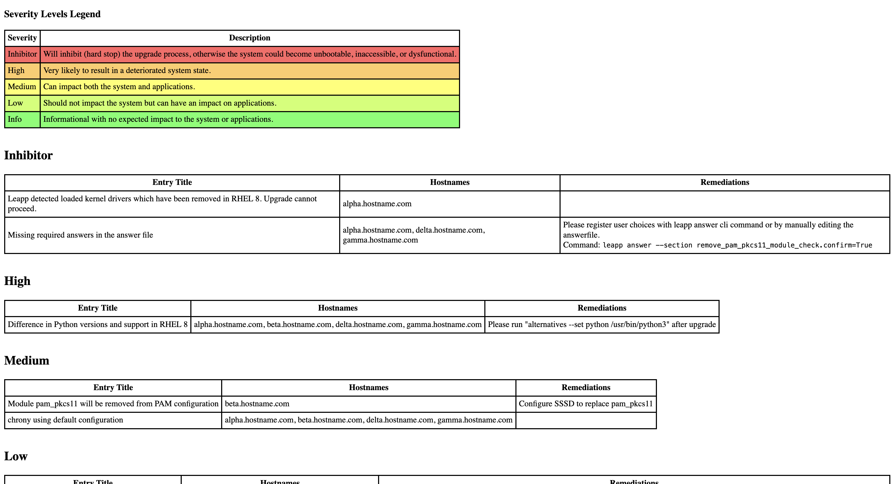

# Leapp Report Analyzer

Leapp Report Analyzer is a command-line tool for analyzing multiple **[Leapp](https://github.com/oamg/leapp)** reports and grouping systems by severity and entries.
The tool processes JSON files containing Leapp reports and generates a JSON file and an HTML table displaying the results.

By analyzing Leapp reports and providing organized output, the Leapp Report Analyzer simplifies the process of identifying and addressing potential issues in your systems.

More information about Leapp:
- [Leapp GitHub repository](https://github.com/oamg/leapp) - report schemas can be found here ([v100](https://github.com/oamg/leapp/blob/master/report-schema-v100.json), [v110](https://github.com/oamg/leapp/blob/master/report-schema-v110.json), [v120](https://github.com/oamg/leapp/blob/master/report-schema-v120.json))
- [Leapp Documentation](https://leapp.readthedocs.io/en/latest/)

## Preparing Leapp Report JSON Files — Input

To use the Leapp Report Analyzer, make sure to provide Leapp report JSON files as input.
Providing any other type of input, such as the stdout of `leapp preupgrade`, or using a different file format, will cause the script to not work correctly.
Follow these steps to obtain the correct JSON files from your systems:

1. Run `leapp preupgrade` on your machine.
2. Locate the preupgrade report at `/var/log/leapp/leapp-report.json`. Using any other output from `leapp preupgrade` will not work.
3. Move the report to a shared directory (e.g., `reports_directory`).
4. Repeat steps 1-3 for all machines you want to analyze.
5. Once you have gathered all the Leapp reports, run the Leapp Report Analyzer with the folder containing the reports as input (e.g., `-d reports_directory`).

Examples of the Leapp report files can be viewed in the [example-reports](example-reports) directory.
Running the Leapp Report Analyzer on these files will produce the identical files as [example-output.json](example-output.json) and [example-output.html](example-output.html) files.
```bash
python leapp-report-analyzer.py -d examples-reports
```

## Installation

Download the Python script from this repository or use:

```bash
curl -OJL https://raw.githubusercontent.com/oamg/leapp-report-analyzer/main/leapp-report-analyzer.py
```

### Requirements

Script works on both Python2 and Python3, versions:

- Python 2.7
- Python 3.2+

## Usage

You can use the Leapp Report Analyzer with either individual Leapp report JSON files or a directory containing multiple JSON files.
Using one of the following arguments is required:
- `-f / --input-files`: One or more Leapp report JSON files to be analyzed (e.g., `-f report1.json report2.json`).
- `-d / --input-directory`: A directory containing Leapp report JSON files to be analyzed (e.g., `-d reports_directory`).

Output arguments are optional:
- `-o / --output-json`: The output JSON file to store the grouped data (e.g., `-o output.json`). Default: `leapp_report_analysis.json`
- `-t / --output-html`: The output HTML file to store the tables with grouped data (e.g., `-t output.html`). Default: `leapp_report_analysis.html`

For more detailed information, run:
```bash
python leapp-report-analyzer.py -h
```

### Example Usage

Analyze individual Leapp report JSON files:

```bash
python leapp-report-analyzer.py -f report1.json report2.json -o output.json -t output.html
```

Analyze a directory containing Leapp report JSON files:

```bash
python leapp-report-analyzer.py -d reports_directory -o output.json -t output.html
```

Analyze a directory, use the default output file names:

```bash
python leapp-report-analyzer.py -d reports_directory
```

## Severity Levels

The generated report will group entries according to the following severity levels:

- **Inhibitor**: Will inhibit (hard stop) the upgrade process, otherwise the system could become unbootable, inaccessible, or dysfunctional.
- **High**: Very likely to result in a deteriorated system state.
- **Medium**: Can impact both the system and applications.
- **Low**: Should not impact the system but can have an impact on applications.
- **Info**: Informational with no expected impact to the system or applications.

These severity levels help you understand the potential impact of the issues found in the leapp reports and prioritize your actions accordingly.

## Output

The Leapp Report Analyzer generates two output files:

- `output.json`: A JSON file containing the grouped data organized by severity and entry title. Each severity level has a dictionary with the title of the entry as the key and a list of hostnames as the value.
- `output.html`: An HTML file containing tables displaying the grouped data. Each severity level has its own table with two columns: Entry Title and Hostnames.

You can look at the example output below:
- [example-output.json](example-output.json)
- [example-output.html](example-output.html)

Screenshot of the HTML page:

